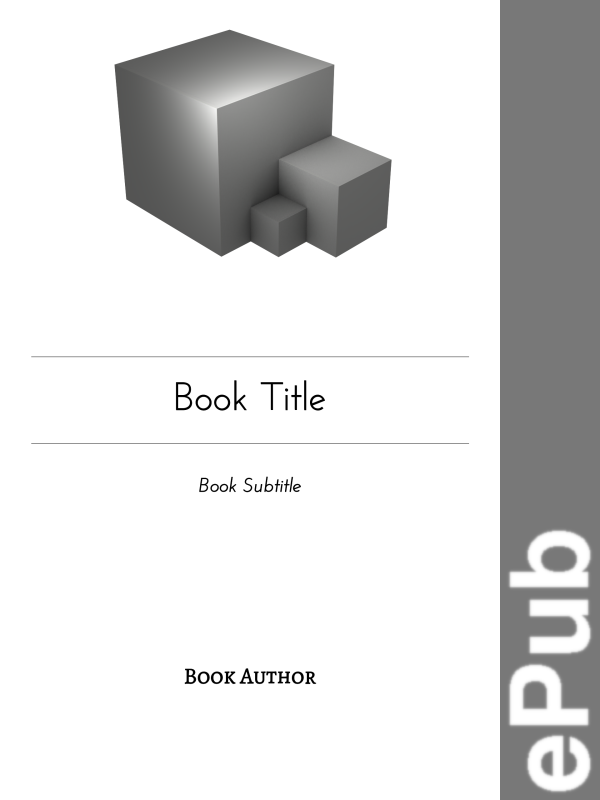

# Org Novelist Export Templates :: Cubes

| Page Type | ePub                                     | PDF                                    |
|-----------|------------------------------------------|----------------------------------------|
| Cover     |       |       |
| Legal     |  |  |
| General   |       |       |

### Table of Contents
- [Introduction](#introduction)
- [Required Programs and Typefaces](#required-programs-and-typefaces)
- [Chapter Tags](#chapter-tags)
- [Index Generators](#index-generators)
- [Configuration Overrides](#configuration-overrides)

# Introduction
These are the 'flagship' templates for the [Org Novelist](https://github.com/sympodius/org-novelist/) writing system, containing a high degree of customisation, and the most polished output for publishing your final novel. I call this look 'Cubes' because the templates automatically generate a cover featuring cubes. Both Cubes Export Templates (PDF and ePub) will produce output files that match each other stylistically. These templates can also produce PDF files suitable for home bookbinders, as well as [Kindle](https://en.wikipedia.org/wiki/Amazon_Kindle) compatible files. The base PDF and ePub files should be suitable for print-on-demand 'US Tradeback' style physical books, or digitally publishing to most eReaders.

Please consult the main Org Novelist repository for [general instructions on using Export Templates](https://github.com/sympodius/org-novelist#exporting) with your novels. The repository here only contains instructions for the specific additional features of the Cubes Export Templates.

# Required Programs and Typefaces
While the Org Novelist export system is built on top of [Org mode's](https://orgmode.org/) default exporters, some of these still need additional programs to be installed, and available on your system `PATH`. In the case of generating [PDF](https://en.wikipedia.org/wiki/PDF) files, this will require a [LaTeX](https://www.latex-project.org/) distribution to be installed. The particular flavour of LaTeX that the Cubes PDF Export Template expects is `XeLaTeX`.

On the other hand, the Cubes [ePub](https://en.wikipedia.org/wiki/EPUB) Export Template only uses Org's markdown exporter for the initial step, and then requires [Pandoc](https://pandoc.org/) and [Imagemagick](https://imagemagick.org/) to actually generate an ePub file. If your system has [Calibre](https://calibre-ebook.com/) installed, then the Cubes ePub Export Template will also produce a [Kindle](https://en.wikipedia.org/wiki/Amazon_Kindle) compatible [azw3](https://en.wikipedia.org/wiki/Kindle_File_Format) file.

| Template                                          | Required Programs                                                                                                  |
|---------------------------------------------------|--------------------------------------------------------------------------------------------------------------------|
| **org-latex-export-to-pdf-tradeback-cubes-en-us** | [XeLaTeX](https://www.latex-project.org/)                                                                          |
| **org-pandoc-export-to-epub-cubes-en-us**         | [Pandoc](https://pandoc.org/),  [Imagemagick Version 7 or Greater](https://imagemagick.org/), and [Calibre](https://calibre-ebook.com/) |

As for typefaces, the Cubes ePub Export Template uses your eReader's standard fonts, but will try to use particular fonts when generating the book's cover image. The Cubes PDF Export Template expects four specific fonts to be installed, but you can override these fonts in your book's configuration settings (see [Export Template Configuration Overrides](#export-template-configuration-overrides)). However, for the best results, the following typefaces should be installed:

| Template                                          | Expected Typefaces                                                                                                                                                                                                                                                                                                                                      |
|---------------------------------------------------|---------------------------------------------------------------------------------------------------------------------------------------------------------------------------------------------------------------------------------------------------------------------------------------------------------------------------------------------------------|
| **org-latex-export-to-pdf-tradeback-cubes-en-us** | [Libre Baskerville](https://fonts.google.com/specimen/Libre+Baskerville) for the main story text, [Josefin Sans](https://fonts.google.com/specimen/Josefin+Sans) for titles and headings, [DejaVu Sans Mono](https://dejavu-fonts.github.io/) for fixed width text, and [Alegreya SC](https://fonts.google.com/specimen/Alegreya+SC) for signature text |
| **org-pandoc-export-to-epub-cubes-en-us**         | [Josefin Sans](https://fonts.google.com/specimen/Josefin+Sans) for the book title on the cover, and [Alegreya SC](https://fonts.google.com/specimen/Alegreya+SC) for the author name on the cover                                                                                                                                                       |

# Chapter Tags
The Cubes Export Templates will try to match Front Matter, Main Matter, and Back Matter styles across all generated file types. 

For Front Matter, this means that chapters will not have "Chapter X" in the title, but will have the chapter name. If the file format supports printed page numbers, it will try to use a separate page numbering system for this section. Whenever possible, Front Matter chapters will appear before the table of contents and will use a plain pagestyle.

For Main Matter, chapter titles will include both the chapter name, and "Chapter X." Main Matter chapters will use the main page count for the book if the file format supports printed page numbers, and will be printed after the table of contents. These chapters will use a headings pagestyle.

For Back Matter, chapters will not have "Chapter X" in the title, but will have the chapter name. When the file format supports printed page numbers, the main page count for the book will be used. Back Matter chapters are always printed after the end of the Main Matter chapters, and will use a plain pagestyle.

These defaults are summarised in this table:

| Matter Type  | "Chapter X" Shown? | Chapter Name Shown? | Main Page Count Used? | Printed Before Table of Contents?     | Pagestyle? |
|--------------|--------------------|---------------------|-----------------------|---------------------------------------|------------|
| Front Matter | No                 | Yes                 | No                    | Yes                                   | Plain      |
| Main Matter  | Yes                | Yes                 | Yes                   | No                                    | Headings   |
| Back Matter  | No                 | Yes                 | Yes                   | No (always printed after Main Matter) | Plain      |

However, the Cubes Export Templates also support overriding some of these defaults by adding [Org mode tags](https://orgmode.org/manual/Tags.html) to the chapter headings in your novel's Chapter Index file. The following table shows the supported tags, and their effects on the Cubes Export Templates (when not supported by a template, the template will ignore the tag):

| Tag                    | Effect                                                                                                                                                                                         | Export Templates Supported |
|------------------------|------------------------------------------------------------------------------------------------------------------------------------------------------------------------------------------------|----------------------------|
| :no\_header:           | Do not include any sort of header at the start of the chapter.                                                                                                                                 | PDF, ePub                  |
| :no\_header\_name:     | Do not include the chapter name at the start of the chapter. The text "Chapter X" will still be shown if Chapter is part of the Main Matter.                                                   | PDF, ePub                  |
| :no\_header\_preamble: | Do not include the text "Chapter X" at the start of the chapter. The chapter name will still be shown. Chapter will still be used to calculate the numbering of other main matter chapters.    | PDF, ePub                  |
| :no\_toc\_entry:       | Do not include chapter in the table of contents. Chapter will have no "Chapter X" text, and will not be used to calculate the numbering of main matter chapters.                               | PDF, ePub                  |
| :empty\_pagestyle:     | Do not display page footers or page headers. In practical terms, this means no page numbers will be dispayed for this chapter, and the chapter name will not be shown at the top of each page. | PDF                        |
| :plain\_pagestyle:     | Display page numbers, centered in the page footer. Do not display any page headers (the chapter name will not be shown at the top of each page). Line gap between paragraphs, but no indent on first line.                                              | PDF                        |
| :part:                 | Treat heading as a "Part" of the story (the level above chapter).                                                                                                                              | PDF, ePub                  |

The :part: tag marks an empty chapter as a new 'Part' in the novel. While Org Novelist won't stop you from also including text within such a chapter, it is not the intended use and the formatting in the Cubes Export Templates assumes that a 'Part' chapter will be empty of content text. It will try to do the right thing if you include content, but the results may not be satisfactory.

| Normal Pagestyle                              | Plain Pagestyle                             |
|-----------------------------------------------|---------------------------------------------|
|  |  |

# Index Generators
Both the Cubes ePub and PDF Export Templates have support for Org Novelist's Index generator system. The PDF version will use accurate page numbers and links according to those displayed within the text. The ePub version, however, will use virtual page numbers to give an indication of where and how often index items appear within a novel. This also means that the page numbers given in the ePub and PDF versions of the index will likely not match each other exactly.

| ePub Index                    | PDF Index                   |
|-------------------------------|-----------------------------|
|  |  |

# Configuration Overrides
You can override features of the Cubes Export Templates by adding file properties to your novel's `org-novelist-config.org` file. Org Novelist's main documentation demonstrated this by showing how to override the novel's author, etc.

The accepted configuration properties are listed here. Some will only affect the Cubes PDF Export Template, and some will only affect the Cubes ePub Export Template. Others will work for both. When an Export Template does not support a given property, it will ignore it.

| Property                                               | Default                                                                                                                                                                         | Effect                                                                                                                                                                                                                                                                                                                                                            | Export Templates Supported |
|--------------------------------------------------------|---------------------------------------------------------------------------------------------------------------------------------------------------------------------------------|-------------------------------------------------------------------------------------------------------------------------------------------------------------------------------------------------------------------------------------------------------------------------------------------------------------------------------------------------------------------|----------------------------|
| #+TITLE:                                               |                                                                                                                                                                                 | The title of the book.                                                                                                                                                                                                                                                                                                                                            | PDF, ePub                  |
| #+SUBTITLE:                                            |                                                                                                                                                                                 | The secondary title of the book.                                                                                                                                                                                                                                                                                                                                  | PDF, ePub                  |
| #+AUTHOR:                                              |                                                                                                                                                                                 | The author of the book.                                                                                                                                                                                                                                                                                                                                           | PDF, ePub                  |
| #+EMAIL:                                               |                                                                                                                                                                                 | The email address of the book author.                                                                                                                                                                                                                                                                                                                             | PDF, ePub                  |
| #+DATE:                                                |                                                                                                                                                                                 | The publication date of the book as an inactive Org timestamp.                                                                                                                                                                                                                                                                                                    | PDF, ePub                  |
| #+HEADFONT:                                            | Josefin Sans                                                                                                                                                                    | The typeface to use as the headings font. Must be installed on the system.                                                                                                                                                                                                                                                                                        | PDF, ePub                  |
| #+SIGNATUREFONT:                                       | Alegreya SC                                                                                                                                                                     | The typeface to use as the signature font. Must be installed on the system.                                                                                                                                                                                                                                                                                       | PDF, ePub                  |
| #+TITLE\_PAGE\_GRAPHIC:                                | cubes.png                                                                                                                                                                       | Location of image file to include when generating the title page.                                                                                                                                                                                                                                                                                                 | PDF, ePub                  |
| #+TITLE\_PAGE\_GRAPHIC\_SCALE:                         | 0.175                                                                                                                                                                           | The scaled display size (fraction of normal 1.000) of TITLE\_PAGE\_GRAPHIC.                                                                                                                                                                                                                                                                                       | PDF, ePub                  |
| #+TITLE\_PAGE\_GRAPHIC\_COPYRIGHT:                     | /`Cube Family'/ is copyright \copy 2012 Martin Anderson (2012--?)@@latex:\\@@@@html: @@ Made with Blender 3D --- @@html:<code>@@[[https://www.blender.org]]@@html:</code>@@ | Copyright credit for TITLE\_PAGE\_GRAPHIC.                                                                                                                                                                                                                                                                                                                        | PDF, ePub                  |
| #+TITLE\_PAGE\_GRAPHIC\_LICENSE:                       | CC-BY-NC-SA-4.0                                                                                                                                                                 | License statement for TITLE\_PAGE\_GRAPHIC. Any text is viable (eg, "All rights reserved."), but the following Creative Commons codes will be handled automatically if used (see [https://creativecommons.org](https://creativecommons.org) for more information): CC0-1.0, CC-BY-4.0, CC-BY-SA-4.0, CC-BY-ND-4.0, CC-BY-NC-4.0, CC-BY-NC-SA-4.0, CC-BY-NC-ND-4.0 | PDF, ePub                  |
| #+PUBLISHER:                                           |                                                                                                                                                                                 | The name of the story's publisher, if there is one.                                                                                                                                                                                                                                                                                                               | PDF, ePub                  |
| #+ISBN:                                                |                                                                                                                                                                                 | ISBN number of the book, if there is one.                                                                                                                                                                                                                                                                                                                         | PDF, ePub                  |
| #+EDITION:                                             | Early Draft Edition (not for publication)                                                                                                                                       | Text describing this edition.                                                                                                                                                                                                                                                                                                                                     | PDF, ePub                  |
| #+LICENSE:                                             | All rights reserved.                                                                                                                                                            | License statement for story. Any text is viable (eg, "All rights reserved."), but the following Creative Commons codes will be handled automatically if used (see [https://creativecommons.org](https://creativecommons.org) for more information): CC0-1.0, CC-BY-4.0, CC-BY-SA-4.0, CC-BY-ND-4.0, CC-BY-NC-4.0, CC-BY-NC-SA-4.0, CC-BY-NC-ND-4.0                | PDF, ePub                  |
| #+SIGIL\_GRAPHIC:                                      |                                                                                                                                                                                 | Location of author's sigil image file, if needed (eg, ../Images/juf-sigil.pdf).                                                                                                                                                                                                                                                                                   | PDF, ePub                  |
| #+SIGIL\_GRAPHIC\_SCALE:                               | 1.000                                                                                                                                                                           | The scaled display size (fraction of normal 1.000) of SIGIL\_GRAPHIC.                                                                                                                                                                                                                                                                                             | PDF, ePub                  |
| #+TYPEFACE\_SIZE:                                      | 0.795                                                                                                                                                                           | The size of the main text (fraction of normal 1.000) for the document.                                                                                                                                                                                                                                                                                            | PDF                        |
| #+MONOFONT\_TYPEFACE\_SIZE\_ADJUSTMENT:                | 1.000                                                                                                                                                                           | The size of monospaced fonts as a fraction of TYPEFACE\_SIZE.                                                                                                                                                                                                                                                                                                     | PDF                        |
| #+TYPEFACE\_SIZE\_PART:                                | 20                                                                                                                                                                              | The size (in pt) of the part heading text.                                                                                                                                                                                                                                                                                                                        | PDF                        |
| #+TYPEFACE\_SIZE\_CHAPTER:                             | 20                                                                                                                                                                              | The size (in pt) of the chapter heading text.                                                                                                                                                                                                                                                                                                                     | PDF                        |
| #+TYPEFACE\_SIZE\_SECTION:                             | 15                                                                                                                                                                              | The size (in pt) of the section heading text.                                                                                                                                                                                                                                                                                                                     | PDF                        |
| #+TYPEFACE\_SIZE\_SUBSECTION:                          | 11                                                                                                                                                                              | The size (in pt) of the subsection heading text.                                                                                                                                                                                                                                                                                                                  | PDF                        |
| #+TYPEFACE\_SIZE\_SUBSUBSECTION:                       | 11                                                                                                                                                                              | The size (in pt) of the subsubsection heading text.                                                                                                                                                                                                                                                                                                               | PDF                        |
| #+TYPEFACE\_SIZE\_PARAGRAPH:                           | 11                                                                                                                                                                              | The size (in pt) of the paragraph heading text.                                                                                                                                                                                                                                                                                                                   | PDF                        |
| #+TYPEFACE\_SIZE\_SUBPARAGRAPH:                        | 11                                                                                                                                                                              | The size (in pt) of the paragraph heading text.                                                                                                                                                                                                                                                                                                                   | PDF                        |
| #+MAINFONT:                                            | Libre Baskerville                                                                                                                                                               | The typeface to use as the main text font. Must be installed on the system.                                                                                                                                                                                                                                                                                       | PDF                        |
| #+MONOFONT:                                            | DejaVu Sans Mono                                                                                                                                                                | The typeface to use as the monospaced font. Must be installed on the system.                                                                                                                                                                                                                                                                                      | PDF                        |
| #+TITLE\_PAGE\_REPLACEMENT\_GRAPHIC\_OLETPTCEU:        |                                                                                                                                                                                 | Location of image file to replace the generated title page, if needed (eg, ../Images/ReplacementTitlePage.png).                                                                                                                                                                                                                                                   | PDF                        |
| #+TITLE\_PAGE\_REPLACEMENT\_GRAPHIC\_OLETPTCEU\_SCALE: | 1.000                                                                                                                                                                           | The scaled display size (fraction of normal 1.000) of TITLE\_PAGE\_REPLACEMENT\_GRAPHIC\_OLETPTCEU.                                                                                                                                                                                                                                                               | PDF                        |
| #+MAKE\_BOOKLET:                                       | t                                                                                                                                                                               | Also output an imposed booklet version of PDF for bookbinding?                                                                                                                                                                                                                                                                                                    | PDF                        |
| #+BOOKLET\_SIGNATURE\_SIZE:                            | 6                                                                                                                                                                               | If MAKE\_BOOKLET is t, set the number of leaves in booklet signatures for bookbinding.                                                                                                                                                                                                                                                                            | PDF                        |
| #+BOOKLET\_BUFFER\_PAGES:                              | 2                                                                                                                                                                               | If MAKE\_BOOKLET is t, set the number of blank pages at start and end of booklet for bookbinding.                                                                                                                                                                                                                                                                 | PDF                        |
| #+TYPEFACE\_SIZE\_HEADFONT\_OPETECEU:                  | 126                                                                                                                                                                             | The size (in pt) of the title text in the generated ePub cover.                                                                                                                                                                                                                                                                                                   | ePub                       |
| #+TYPEFACE\_SIZE\_SIGNATUREFONT\_OPETECEU:             | 72                                                                                                                                                                              | The size (in pt) of the author text in the generated ePub cover.                                                                                                                                                                                                                                                                                                  | ePub                       |
| #+TITLE\_PAGE\_REPLACEMENT\_GRAPHIC\_OPETECEU:         |                                                                                                                                                                                 | Location of image file to replace the generated title page, if needed (eg, ../Images/ReplacementTitlePage.png).                                                                                                                                                                                                                                                   | ePub                       |
| #+TITLE\_PAGE\_REPLACEMENT\_GRAPHIC\_OPETECEU\_SCALE:  | 1.000                                                                                                                                                                           | The scaled display size (fraction of normal 1.000) of TITLE\_PAGE\_REPLACEMENT\_GRAPHIC\_OPETECEU.                                                                                                                                                                                                                                                                | ePub                       |

