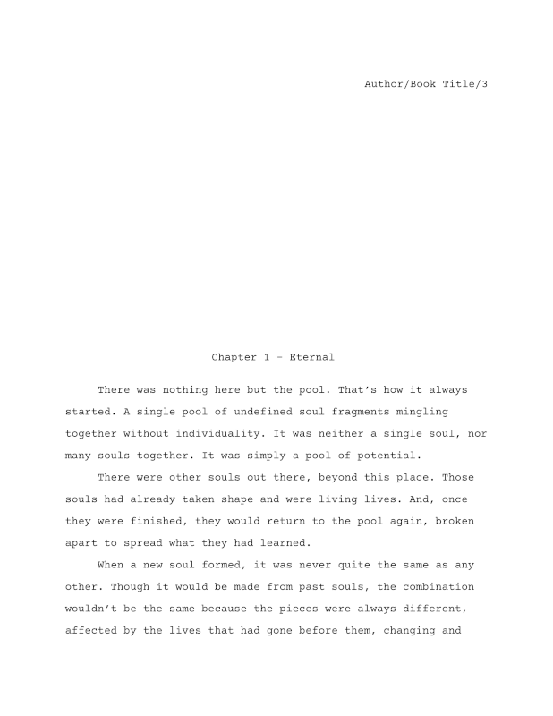

# Org Novelist Export Templates :: Manuscript

| Cover                                  | General                                |
|----------------------------------------|----------------------------------------|
|  |  |

### Table of Contents
- [Introduction](#introduction)
- [Required Programs and Typefaces](#required-programs-and-typefaces)
- [Chapter Tags](#chapter-tags)
- [Configuration Overrides](#configuration-overrides)

# Introduction
Manuscript templates are intended to create an industry '[standard manuscript format](https://en.wikipedia.org/wiki/Standard_manuscript_format)' file for submitting to editors, agents, and publishers.

Only one template is included under this category right now. It produces a manuscript as an [OpenDocument Text](https://en.wikipedia.org/wiki/OpenDocument) file, suitable for use in many word processors.

Please consult the main Org Novelist repository for [general instructions on using Export Templates](https://github.com/sympodius/org-novelist#exporting) with your novels. The repository here only contains instructions for the specific additional features of the Manuscript Export Templates.

# Required Programs and Typefaces
While the Org Novelist export system is built on top of [Org mode's](https://orgmode.org/) default exporters, some of these still need additional programs to be installed, and available on your system `PATH`.

| Template                               | Required Programs                                      |
|----------------------------------------|--------------------------------------------------------|
| **org-odt-export-to-manuscript-en-us** | [zip](https://en.wikipedia.org/wiki/Info-ZIP) |

The Manuscript Export Template requires the following typefaces to be installed:

| Template                               | Required Typefaces                                               |
|----------------------------------------|------------------------------------------------------------------|
| **org-odt-export-to-manuscript-en-us** | [Courier Prime](https://fonts.google.com/specimen/Courier+Prime) |

# Chapter Tags
The Manuscript Export Templates will style sections as Front Matter, Main Matter, and Back Matter. 

For Front Matter, this means that chapters will not have "Chapter X" in the title, but will have the chapter name. Front Matter chapters will appear before the Main Matter.

For Main Matter, chapter titles will include both the chapter name, and "Chapter X."

For Back Matter, chapters will not have "Chapter X" in the title, but will have the chapter name. Back Matter chapters are always printed after the end of the Main Matter chapters.

These defaults are summarised in this table:

| Matter Type  | "Chapter X" Shown? | Chapter Name Shown? |
|--------------|--------------------|---------------------|
| Front Matter | No                 | Yes                 |
| Main Matter  | Yes                | Yes                 |
| Back Matter  | No                 | Yes                 |

However, the Manuscript Export Templates also support overriding some of these defaults by adding [Org mode tags](https://orgmode.org/manual/Tags.html) to the chapter headings in your novel's Chapter Index file. The following table shows the supported tags, and their effects on the Manuscript Export Templates:

| Tag                    | Effect                                                                                                                                                                                                                            |
|------------------------|-----------------------------------------------------------------------------------------------------------------------------------------------------------------------------------------------------------------------------------|
| :no\_header:           | Do not include any sort of header at the start of the chapter.                                                                                                                                                                    |
| :no\_header\_name:     | Do not include the chapter name at the start of the chapter. The text "Chapter X" will still be shown if Chapter is part of the Main Matter.                                                                                      |
| :no\_header\_preamble: | Do not include the text "Chapter X" at the start of the chapter. The chapter name will still be shown. Chapter will still be used to calculate the numbering of other main matter chapters.                                       |
| :no\_toc\_entry:       | Chapter will have no "Chapter X" text, and will not be used to calculate the numbering of main matter chapters. However, if user actively generates a table of contents in post, then this chapter will likely still be included. |
| :part:                 | Treat heading as a "Part" of the story (the level above chapter).*                                                                                                                                                                |

*The :part: tag marks an empty chapter as a new 'Part' in the novel. While Org Novelist won't stop you from also including text within such a chapter, it is not the intended use and the formatting in the Manuscript Export Templates assumes that a 'Part' chapter will be empty of content text. It will try to do the right thing if you include content, but the results may not be satisfactory.

# Configuration Overrides
You can override features of the Manuscript Export Templates by adding file properties to your novel's `org-novelist-config.org` file. Org Novelist's main documentation demonstrated this by showing [how to override the novel's author](https://github.com/sympodius/org-novelist#exporting), etc.

The accepted configuration properties are listed here:

| Property    | Effect                                                         |
|-------------|----------------------------------------------------------------|
| #+TITLE:    | The title of the book.                                         |
| #+SUBTITLE: | The secondary title of the book.                               |
| #+AUTHOR:   | The author of the book.                                        |
| #+EMAIL:    | The email address of the book author.                          |
| #+DATE:     | The publication date of the book as an inactive Org timestamp. |
